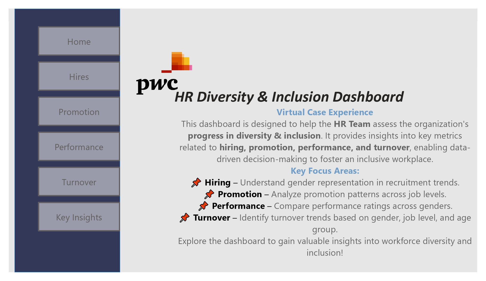
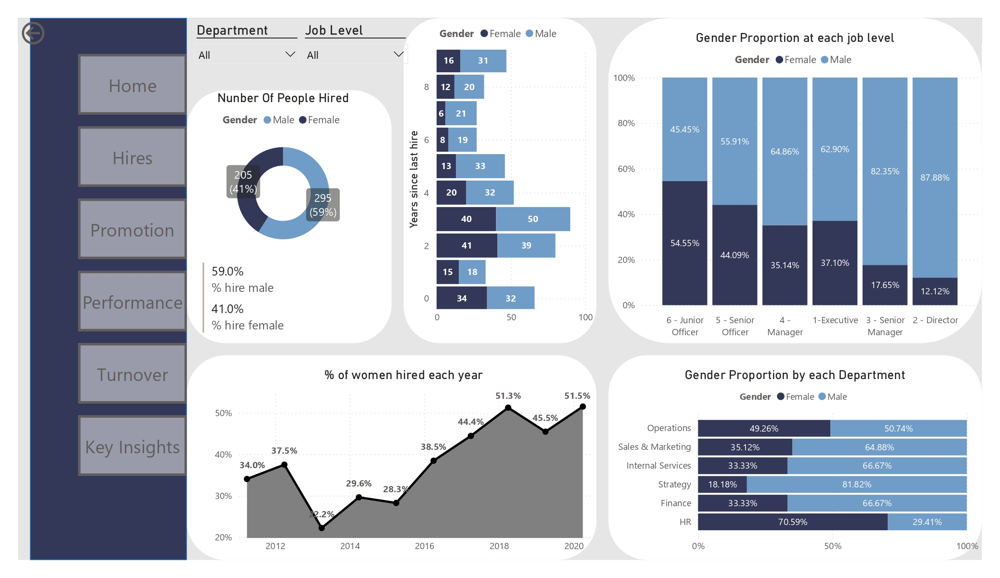
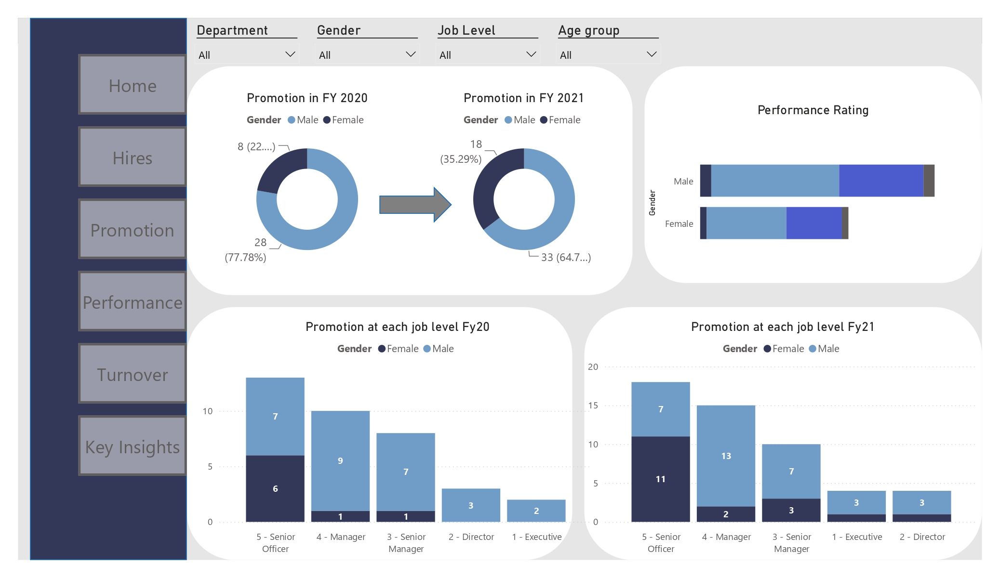
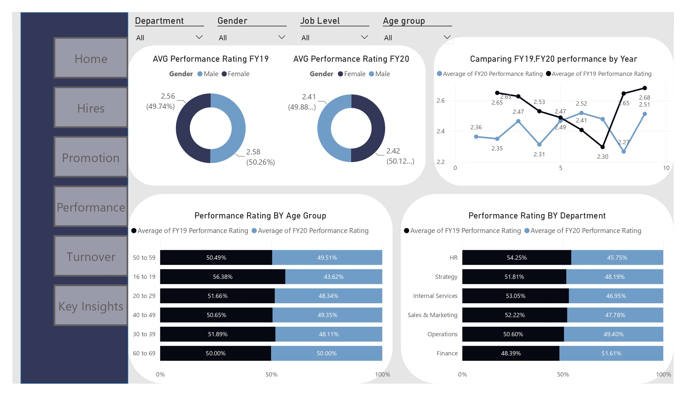
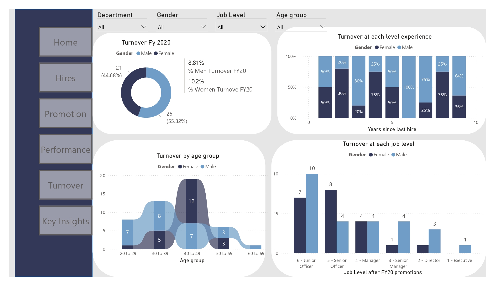
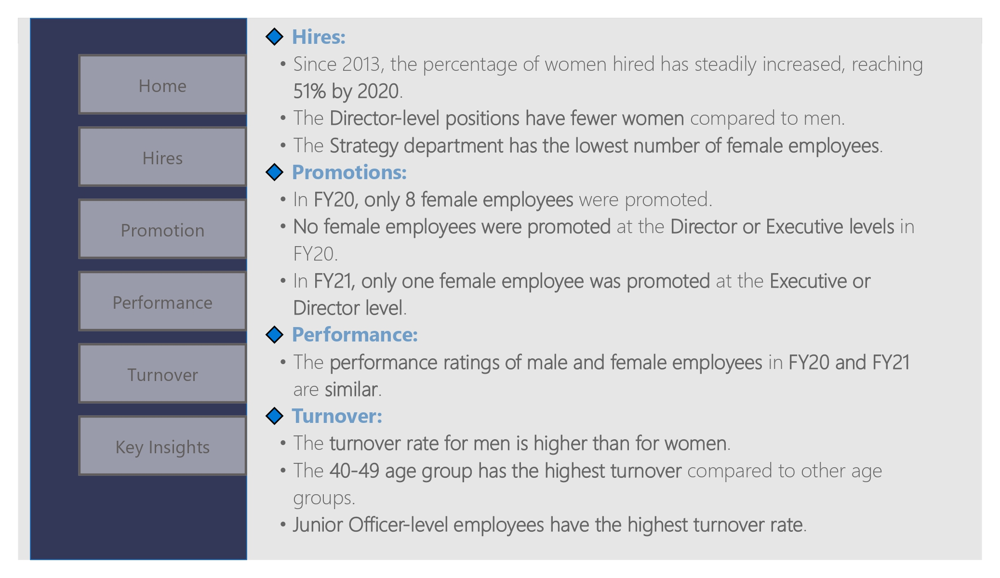

# HR Diversity & Inclusion Analytics Dashboard

## Overview
This project analyzes workforce diversity and inclusion metrics for an organization across recruitment, promotion patterns, performance evaluations, and employee turnover. The objective was to build an interactive multi-page Power BI dashboard to help the HR team track gender balance and workforce dynamics.

## Tools & Technologies
- **Power BI Desktop:** Multi-page dashboard layout, DAX measures, relational data modeling, and custom interactive visuals
- **Power Query:** Data extraction, transformation, and type formatting
- **Microsoft Excel:** Source dataset

---

## Key Metrics & Data Insights

### 1. Recruitment Trends
- **Hiring Growth:** Female hiring has steadily increased since 2013, reaching **51.5% in 2020** (205 females vs. 295 males hired overall across the period).
- **Department Breakdown:** High female representation in HR (**70.59%**), but significantly lower in Strategy (**18.18%**) and Sales & Marketing (**35.12%**).

### 2. Promotion & Executive Representation
- **Senior Role Disparity:** Senior roles remain male-dominated, with male representation at **87.88% in Director positions** and **62.90% at the Executive level**.
- **Promotion Gap:** 
  - In FY20, only **8 female employees (22.22%)** were promoted, with zero promotions at Director or Executive levels.
  - In FY21, female promotions improved to **18 (35.29%)**, though only one female reached the executive tier.

### 3. Performance & Attrition
- **Performance Evaluation:** Performance ratings remain evenly balanced across genders, with average scores of **2.41 for females** and **2.42 for males** in FY20.
- **Turnover Trends:** Overall turnover in FY20 was **8.81% for men** and **10.2% for women**. Peak turnover occurred among Junior Officers and employees in the **40–49 age bracket**.

---

## Dashboard Pages & Previews

### Page 1: Overview & Landing Page

### Page 2: Hiring Analysis

### Page 3: Promotion Patterns

### Page 4: Performance Ratings

### Page 5: Turnover & Attrition

### Page 6: Executive Key Insights

---

## Key Recommendations
1. **Leadership Diversity Pipeline:** Establish internal development and mentorship initiatives for mid-level female staff (Senior Officers & Managers) to bridge the promotion gap to Director/Executive tiers.
2. **Targeted Recruitment:** Re-evaluate recruitment strategies for Strategy, Finance, and Sales teams where female representation remains under 35%.
3. **Junior Retention:** Address career progression and retention programs specifically for early-career Junior Officers to curb early attrition.
